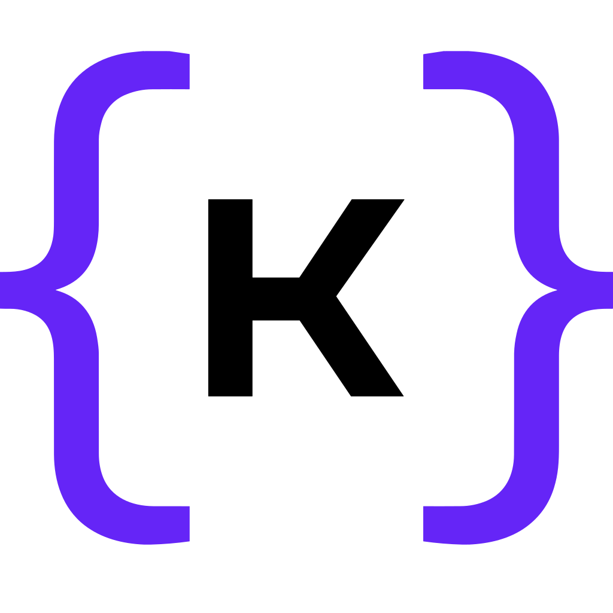

# Kluster Verify MCP Self-hosted Server

An example Model Context Protocol (MCP) server demonstrating integration with kluster.ai's Verify service for fact-checking capabilities in AI applications.

**Note**: This is an example implementation to showcase the kluster.ai Verify service. A native MCP platform integration is coming soon which will replace this implementation.

## Features

- **Fact Checking** - Verify claims against reliable sources using kluster.ai's AI-powered analysis.
- **Search Results** - Get contextual search results for verification and source checking.
- **Docker Support** - Containerized deployment for consistent environments.
- **TypeScript** - Full type safety and modern development experience.
- **MCP Integration** - Seamless integration with Claude Desktop and other MCP clients.

## Quick Start

### Prerequisites

Before getting started with MCP integration, ensure the following requirements are met:

- **[Docker Desktop](https://www.docker.com/products/docker-desktop/){target=_blank}** installed and running.
- **[Git](https://git-scm.com/){target=_blank}** for cloning the repository.
- **[Claude Desktop](https://claude.ai/download){target=_blank}** for testing (or another MCP client).
- **kluster.ai API key** - [Get one here](https://kluster.ai){target=_blank}.

### Setup

1. **Clone the repository**
   ```bash
   git clone https://github.com/kluster-ai/verify-mcp
   cd verify-mcp
   ```

2. **Build the Docker image**
   ```bash
   docker build -t kluster-verify-mcp .
   ```

3. **Configure Claude Desktop**
   
   Edit your configuration file:
   - **macOS**: `~/Library/Application Support/Claude/claude_desktop_config.json`
   - **Windows**: `%APPDATA%/Claude/claude_desktop_config.json`

   ```json
   {
     "mcpServers": {
       "kluster-verify-mcp": {
         "command": "docker",
         "args": [
           "run",
           "--rm",
           "--interactive",
           "kluster-verify-mcp",
           "--api-key",
           "YOUR_API_KEY"
         ]
       }
     }
   }
   ```

4. **Replace `YOUR_API_KEY`** with your actual kluster.ai API key.

5. **Restart Claude Desktop** to load the new server.

## Usage

The server provides two powerful tools for verification and fact-checking:

### 1. Claim Verification Tool (`verify`)

Verify standalone claims against reliable sources using kluster.ai Verify service:


```json
{
  "claim": "The Eiffel Tower is located in Rome",
  "return_search_results": true
}
```

**Response:**
```json
{
  "claim": "The Eiffel Tower is located in Rome",
  "is_hallucination": true,
  "explanation": "The response provides a wrong location for the Eiffel Tower.\nThe Eiffel Tower is actually located in Paris, France, not in Rome.\nThe response contains misinformation as it incorrectly states the tower's location.",
  "usage": {
    "completion_tokens": 343,
    "prompt_tokens": 939,
    "total_tokens": 1282
  },
  "search_results": []
}
```

**Parameters**

- **`claim`** (required) - The statement to verify using kluster.ai Verify service.
- **`return_search_results`** (optional) - Whether to include search results for verification (default: true).

---

### 2. Document Claim Verification (`verify_document`)

Verify if a user's claim accurately reflects the content of a source document using kluster.ai Verify service. This tool is perfect for checking interpretations, quotes, or data extractions from documents.

**How it works:**
1. Upload or paste a document into Claude Desktop
2. Make a claim about what the document says
3. Claude automatically uses this tool to verify your interpretation against the actual document content using kluster.ai Verify service

```json
{
  "claim": "This employment contract allows unlimited remote work",
  "document_content": "Section 4.2: Employee must maintain primary residence within 50 miles of headquarters and work on-site minimum 3 days per week...",
  "return_search_results": true
}
```

**Response:**
```json
{
  "claim": "This employment contract allows unlimited remote work",
  "is_hallucination": true,
  "explanation": "The claim is incorrect. Section 4.2 explicitly requires on-site work minimum 3 days per week and residence within 50 miles of headquarters.",
  "usage": {
    "completion_tokens": 156,
    "prompt_tokens": 890,
    "total_tokens": 1046
  },
  "search_results": []
}
```

**Parameters**
- **`claim`** (required) - Your interpretation or statement about the document.
- **`document_content`** (required) - Full text of the source document (automatically filled by Claude).
- **`return_search_results`** (optional) - Whether to include additional search results (default: true).

**Use Cases**
- **Academic Research** - Verify your interpretation of research papers.
- **Legal Documents** - Check understanding of contracts or legal texts.
- **News Analysis** - Verify claims about what articles actually say.
- **Data Extraction** - Confirm extracted facts match the source.
- **Quote Verification** - Ensure quotes are accurate and in context.


---

### Tool Selection

Claude Desktop automatically chooses the right tool:

- **`verify`** - For general claims without source documents.
- **`verify_document`** - When you're working with a document and make claims about its content.

## Client Setup

### Supported MCP Clients

- **Claude Desktop** - Full support with automatic document content parsing.
- **VS Code Copilot Chat** - Agent Mode support with secure API key input.
- **n8n** - Native workflow templates available for SSE deployment.
- **Other MCP clients** - Should work with any MCP-compatible client.

For detailed client setup instructions, see the [client documentation](https://docs.kluster.ai/get-started/mcp/self-hosted/clients/){target=_blank}.

### SSE Server

For platforms that don't support native MCP but need HTTP endpoints, the verify-mcp repository includes an SSE (Server-Sent Events) server.

**SSE server setup:**
```bash
git clone https://github.com/kluster-ai/verify-mcp
cd verify-mcp
npm run sse:start -- --api-key YOUR_KLUSTER_AI_API_KEY --port 3001
```

**Available endpoints:**
- **Tools List** - `GET http://localhost:3001/tools`
- **Health Check** - `GET http://localhost:3001/health`
- **Verify Tool** - `POST http://localhost:3001/tools/verify`
- **Verify Document Tool** - `POST http://localhost:3001/tools/verify_document`

### Command Line Options

- `--api-key <key>` - Your kluster.ai API key (required).
- `--base-url <url>` - API base URL (default: https://api.kluster.ai/v1).

### Environment Variables

- `KLUSTER_API_KEY` - Alternative way to provide API key.
- `KLUSTER_AI_BASE_URL` - Alternative way to provide base URL.

## Development

### Local Development

1. **Clone and install**
   ```bash
   git clone https://github.com/kluster-ai/verify-mcp
   cd verify-mcp
   npm install
   ```

2. **Build TypeScript**
   ```bash
   npm run build
   ```

3. **Run locally**
   ```bash
   npm run dev -- --api-key INSERT_KLUSTER_API_KEY
   ```

### Scripts

- `npm run build` - Compile TypeScript to JavaScript.
- `npm run dev` - Run in development mode with tsx.
- `npm start` - Run the built server.
- `npm run lint` - Run ESLint.
- `npm run typecheck` - Type check without emitting files.
- `npm run sse:start` - Start SSE server for HTTP endpoints.

## Architecture

The server consists of two main components:

### kluster.ai Client (`src/kluster-client.ts`)
- Handles API communication with kluster.ai.
- Manages authentication and request formatting.
- Provides type-safe interfaces for requests and responses.

### MCP Server (`src/index.ts`)
- Implements the Model Context Protocol.
- Exposes the `verify` and `verify_document` tools.
- Handles CLI arguments and configuration.
- Maps MCP requests to API calls.

## API Integration

The server integrates with kluster.ai's `/verify/reliability` endpoint:

```typescript
// Request format
{
  "prompt": "Please verify this claim for accuracy:",
  "output": "The claim to be verified",
  "return_search_results": "true"
}

// Response format
{
  "is_hallucination": boolean,
  "explanation": string,
  "usage": { ... },
  "search_results": [ ... ]
}
```

## How to Use

Once you have reopened the MCP client (Claude Desktop), you should be able to see the tools listed under `kluster-verify-mcp`.

### Verify

Ask Claude to verify something obviously wrong:

> "Use the Verify tool and tell me if The Eiffel Tower is located in Rome".

Claude should automatically use the `verify` tool and provide:

- **Verification result** - Whether the claim is accurate.
- **Detailed explanation** - Why it's wrong with supporting reasoning.
- **Source citations** - Search results used for verification.

### Verify Document

Ideal for detecting hallucinations or false claims from documents. Upload any document to Claude, then ask to verify against a statement:

> "This document says X. Use the verify_document tool and check if that's accurate."

Claude should use the `verify_document` tool to verify your claim against the actual document content.

## Troubleshooting

### Common Issues

**404 Errors**: Ensure `--base-url` is set to just the base URL (`https://api.kluster.ai/v1`), not the full endpoint path.

**Authentication Errors**: Verify your API key is correct and has proper permissions.

**Docker Issues**: Make sure Docker is running and the image is built correctly.

### Debug Mode

Enable debug logging in development by uncommenting the debug lines in `src/kluster-client.ts`:

```typescript
// Uncomment for debugging
console.error(`[DEBUG] API Request:`, JSON.stringify(payload, null, 2));
console.error(`[DEBUG] Response:`, JSON.stringify(response.data, null, 2));
```

## Contributing

1. Fork the repository.
2. Create a feature branch.
3. Make your changes.
4. Test with `npm run lint` and `npm run typecheck`.
5. Submit a pull request.

## License

MIT License - see LICENSE file for details.

- **kluster.ai API**: [Official Documentation](https://kluster.ai/docs){target=_blank}