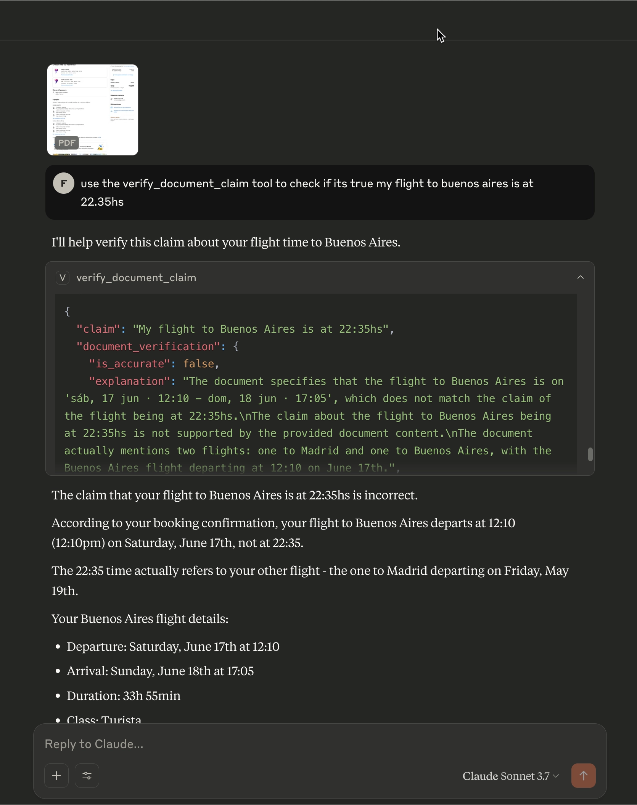
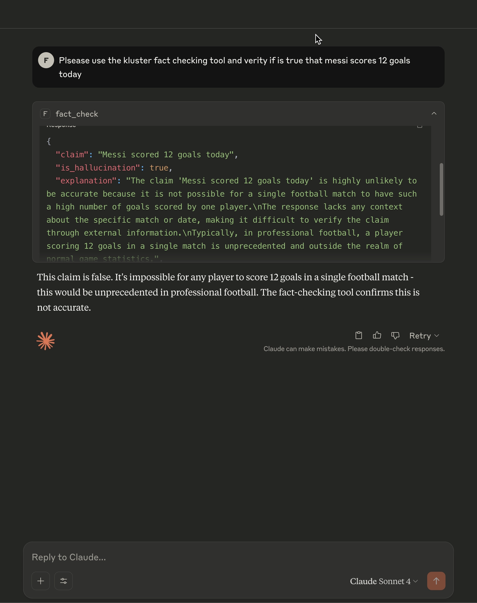

# kluster verify MCP Server

A production-ready Model Context Protocol (MCP) server that integrates with kluster.ai's verification API to provide fact-checking capabilities for AI applications.

## Features

- **Fact Checking**: Verify claims against reliable sources using kluster.ai's AI-powered analysis
- **Search Results**: Get contextual search results for verification and source checking
- **Docker Support**: Containerized deployment for consistent environments
- **TypeScript**: Full type safety and modern development experience
- **MCP Integration**: Seamless integration with Claude Desktop and other MCP clients

## Quick Start

### Prerequisites

- Docker installed on your system
- A kluster.ai API key ([get one here](https://kluster.ai))
- Claude Desktop (for testing)

### Installation

1. **Clone or download this repository**

2. **Build the Docker image:**
   ```bash
   npm run docker:build
   ```

3. **Configure your MCP client** (Claude Desktop or VS Code):
   
   Choose your preferred client and follow the setup guide in the `clients/` directory:
   - **Claude Desktop**: See `clients/claude_desktop/config.json`
   - **VS Code Copilot Chat**: See `clients/vscode/mcp.json`

4. **Replace `YOUR_KLUSTER_AI_API_KEY`** with your actual API key

5. **Restart your MCP client** to load the new server

## Usage

The server provides two powerful tools for verification and fact-checking:

### 1. Fact Checking Tool (`fact_check`)

Verify standalone claims against reliable sources:

```json
{
  "claim": "The Earth is flat",
  "return_search_results": true
}
```

**Response:**
```json
{
  "claim": "The Earth is flat",
  "is_accurate": false,
  "explanation": "This claim contradicts well-established scientific evidence...",
  "confidence": {
    "completion_tokens": 150,
    "prompt_tokens": 50,
    "total_tokens": 200
  },
  "search_results": [
    {
      "title": "NASA - Earth's Shape",
      "snippet": "Scientific evidence shows Earth is spherical...",
      "link": "https://nasa.gov/..."
    }
  ]
}
```

**Parameters:**
- **`claim`** (required): The statement to fact-check
- **`return_search_results`** (optional): Whether to include search results for verification (default: true)

---

### 2. Document Claim Verification (`verify_document_claim`)

Verify if a user's claim accurately reflects the content of a source document. This tool is perfect for checking interpretations, quotes, or data extractions from documents.

**How it works:**
1. Upload or paste a document into Claude Desktop
2. Make a claim about what the document says
3. Claude automatically uses this tool to verify your interpretation against the actual document content

```json
{
  "claim": "This research paper proves that coffee reduces cancer risk by 25%",
  "document_content": "[Full document text automatically provided by Claude]",
  "return_search_results": true
}
```

**Response:**
```json
{
  "claim": "This research paper proves that coffee reduces cancer risk by 25%",
  "is_accurate": false,
  "explanation": "The document states coffee may reduce cancer risk by 15-20%, not 25%. The claim overstates the findings...",
  "confidence": {
    "completion_tokens": 180,
    "prompt_tokens": 1200,
    "total_tokens": 1380
  },
  "search_results": [
    {
      "title": "Coffee and Cancer Research Review",
      "snippet": "Recent studies show coffee consumption linked to reduced cancer risk...",
      "link": "https://example.com/coffee-cancer-study"
    }
  ]
}
```

**Parameters:**
- **`claim`** (required): Your interpretation or statement about the document
- **`document_content`** (required): Full text of the source document (automatically filled by Claude)
- **`return_search_results`** (optional): Whether to include additional search results (default: true)

**Use Cases:**
- **Academic Research**: Verify your interpretation of research papers
- **Legal Documents**: Check understanding of contracts or legal texts  
- **News Analysis**: Verify claims about what articles actually say
- **Data Extraction**: Confirm extracted facts match the source
- **Quote Verification**: Ensure quotes are accurate and in context


*Document verification workflow: Upload document → Make claim → Get verification*


*Detailed example showing the verify_document_claim tool response*

---

### Tool Selection

Claude Desktop automatically chooses the right tool:
- **`fact_check`**: For general claims without source documents
- **`verify_document_claim`**: When you're working with a document and make claims about its content

## Client Setup

### Supported MCP Clients

- **Claude Desktop**: Full support with automatic document content parsing
- **VS Code Copilot Chat**: Agent Mode support with secure API key input
- **n8n**: Native workflow templates available for SSE deployment
- **Other MCP clients**: Should work with any MCP-compatible client

See the `clients/` directory for specific setup instructions for each client.

### n8n Integration 🆕

**SSE server for local n8n development** is available in `clients/n8n/`. This provides:
- **HTTP SSE endpoints** for n8n MCP Tool integration
- **Real-time tool execution** with event broadcasting
- **Local development support** (self-hosted n8n instances)
- **Production deployment ready** with cloud platforms

Quick start: See `clients/n8n/README.md` for setup instructions.

### Command Line Options

- `--api-key <key>`: Your kluster.ai API key (required)
- `--base-url <url>`: API base URL (default: https://api-r.klusterai.dev/v1)

### Environment Variables

- `KLUSTER_AI_API_KEY`: Alternative way to provide API key
- `KLUSTER_AI_BASE_URL`: Alternative way to provide base URL

## Development

### Local Development

1. **Install dependencies:**
   ```bash
   npm install
   ```

2. **Build TypeScript:**
   ```bash
   npm run build
   ```

3. **Run locally:**
   ```bash
   npm run dev -- --api-key YOUR_API_KEY
   ```

### Scripts

- `npm run build` - Compile TypeScript to JavaScript
- `npm run dev` - Run in development mode with tsx
- `npm start` - Run the built server
- `npm run lint` - Run ESLint
- `npm run typecheck` - Type check without emitting files
- `npm run docker:build` - Build Docker image
- `npm run docker:run` - Run Docker container

## Architecture

The server consists of two main components:

### KlusterAIClient (`src/kluster-client.ts`)
- Handles API communication with kluster.ai
- Manages authentication and request formatting
- Provides type-safe interfaces for requests/responses

### MCP Server (`src/index.ts`)
- Implements the Model Context Protocol
- Exposes the `fact_check` tool
- Handles CLI arguments and configuration
- Maps MCP requests to API calls

## API Integration

The server integrates with kluster.ai's `/judges/detect-hallucination` endpoint:

```typescript
// Request format
{
  "prompt": "Please verify this claim for accuracy:",
  "output": "The claim to be verified",
  "return_search_results": "true"
}

// Response format
{
  "is_hallucination": boolean,
  "explanation": string,
  "usage": { ... },
  "search_results": [ ... ]
}
```

## Troubleshooting

### Common Issues

1. **404 Errors**: Ensure `--base-url` is set to just the base URL (`https://api-r.klusterai.dev/v1`), not the full endpoint path

2. **Authentication Errors**: Verify your API key is correct and has proper permissions

3. **Docker Issues**: Make sure Docker is running and the image is built correctly

### Debug Mode

Enable debug logging in development by uncommenting the debug lines in `src/kluster-client.ts`:

```typescript
// Uncomment for debugging
console.error(`[DEBUG] API Request:`, JSON.stringify(payload, null, 2));
console.error(`[DEBUG] Response:`, JSON.stringify(response.data, null, 2));
```

## Contributing

1. Fork the repository
2. Create a feature branch
3. Make your changes
4. Test with `npm run lint` and `npm run typecheck`
5. Submit a pull request

## License

MIT License - see LICENSE file for details.

## Support

- Documentation: This README
- Issues: Create an issue in the repository
- kluster.ai API: [Official Documentation](https://kluster.ai/docs)