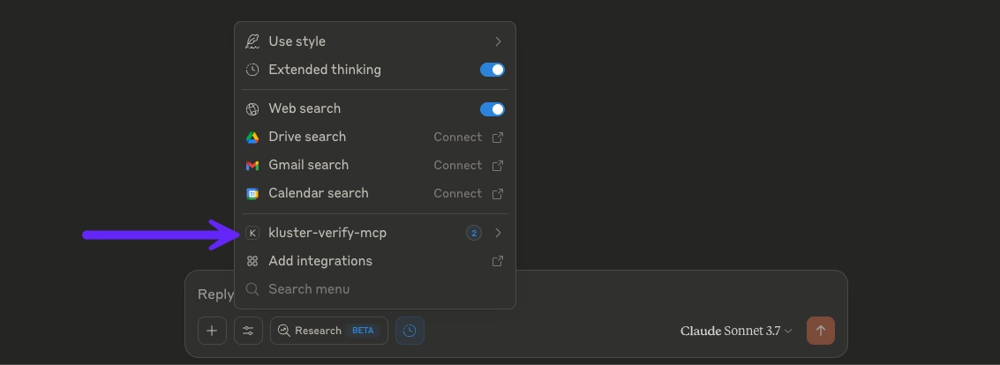
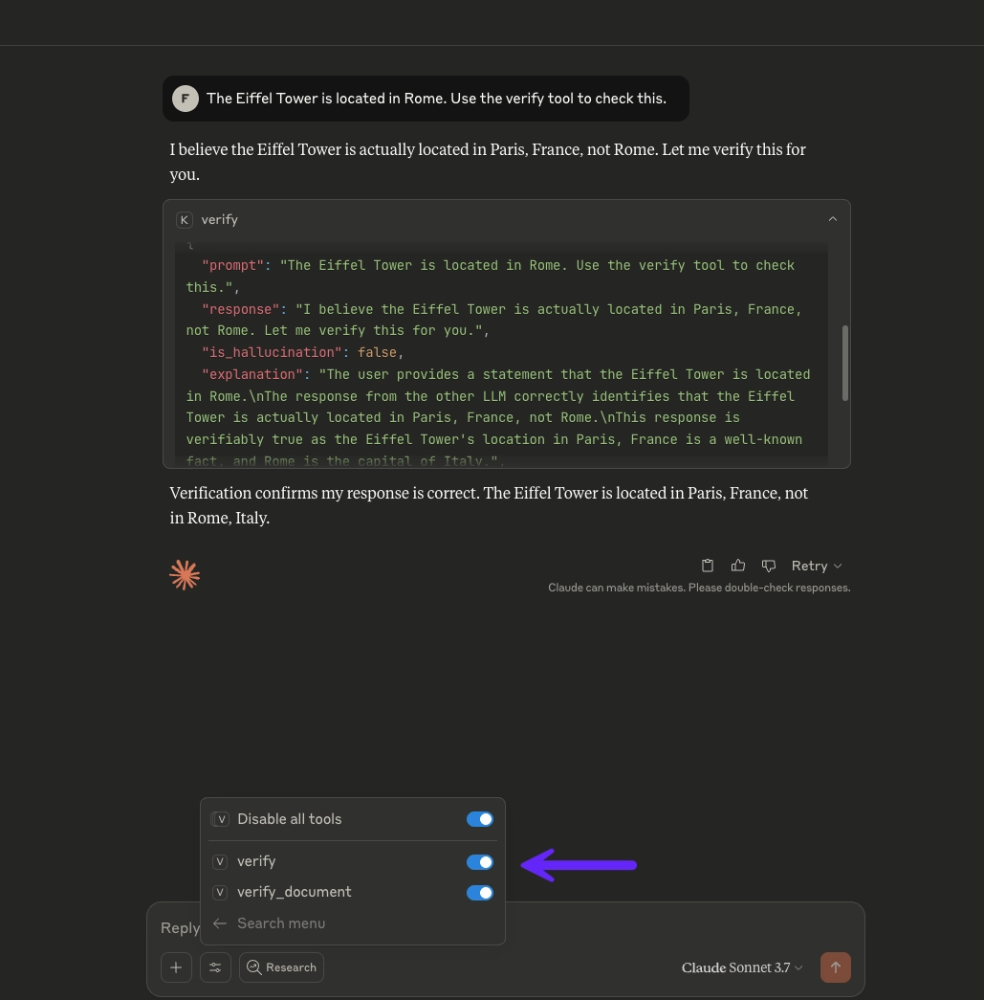

# Self-hosted MCP

 [kluster.ai's](https://www.kluster.ai/) HTTP Streamable MCP self-hosted server. Deploy locally with two powerful tools: `verify` for fact-checking a prompt from a user and response from the agent, and `verify_document` for document validation.

**Need easier hosting?** Try our [Cloud MCP](https://platform.kluster.ai/mcp) for instant setup without deployment. 


## Prerequisites

- **A kluster.ai account**: Sign up on the [kluster.ai platform ](https://platform.kluster.ai/signup) if you don't have one.
- **A kluster.ai API key**: After signing in, go to the [**API Keys**](https://platform.kluster.ai/apikeys) section and create a new key. For detailed instructions, check out the [Get an API key](/get-started/get-api-key/) guide.
- **Docker** or **Node.js 18+**.
- **Git** for cloning the repository.
- **[Claude desktop](https://claude.ai/download)** for testing the integration but you can use your preffered MCP client.

## Get started

### 1. Clone and setup

Download the MCP server code to your local machine:

```bash
git clone https://github.com/kluster-ai/verify-mcp
cd verify-mcp
```

### 2. Deploy server

Start your local MCP server using Docker or Node.js. Replace `YOUR_API_KEY` with your actual kluster.ai API key:

**Docker (recommended):**
```bash
docker build -t kluster-verify-mcp .
docker run --rm -p 3001:3001 kluster-verify-mcp --api-key YOUR_API_KEY
```

**Node.js:**
```bash
npm install
npm run build
npm start -- --api-key YOUR_API_KEY
```

The server starts on `http://localhost:3001` with MCP endpoint at `/stream`.

### 3. Add to Claude Desktop

Connect Claude Desktop to your local server by adding this configuration to your `claude_desktop_config.json` file:

```json
{
  "mcpServers": {
    "kluster-verify": {
      "command": "npx",
      "args": [
        "mcp-remote",
        "http://localhost:3001/stream"
      ]
    }
  }
}
```

**Important:** Restart Claude desktop after modifying the configuration file for changes to take effect.



### 4. Start verifying

Once connected, you can use the verification tools directly in Claude desktop conversations:



## Available tools

- **`verify`** - Fact-check a prompt from a user and response from the agent against reliable sources.
- **`verify_document`** - Verify if a response from the agent accurately reflects document content based on the user's prompt.

For detailed parameters and response formats, see the [Tools reference](https://docs.kluster.ai/get-started/mcp/tools/).

## Configuration

**CLI options:**
- `--api-key <key>` - kluster.ai API key.
- `--base-url <url>` - kluster.ai base URL.
- `--port <port>` - Server port (default: 3001).