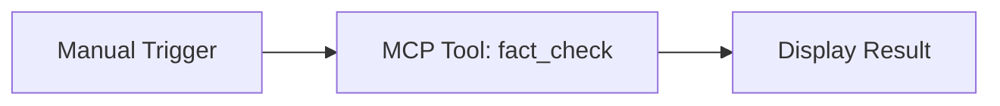
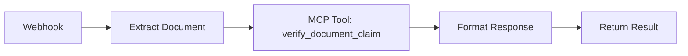

# n8n MCP Tool Setup Guide

This guide shows you how to use **n8n's MCP Tool node** to connect to kluster verify via the SSE server.

## 🎯 What You'll Achieve

- Connect n8n to kluster verify tools
- Use verification tools within n8n workflows and AI agents
- Build automated fact-checking workflows

## 📋 Prerequisites

- [ ] n8n instance running (cloud or self-hosted)
- [ ] kluster.ai API key
- [ ] SSE server running (see below)

## 🚀 Step 1: Start the SSE Server

**Note:** The SSE server is now in its own directory since it supports multiple clients.

```bash
# Navigate to project root
cd /path/to/kluster-verify

# Install dependencies
npm install

# Start SSE server
npm run dev:sse -- --api-key YOUR_KLUSTER_AI_API_KEY
```

For detailed SSE server setup and options, see [`../sse-server/README.md`](../sse-server/README.md).

You should see:
```
🚀 kluster.ai SSE Server started successfully!
📍 Server URL: http://localhost:3001
📡 SSE Endpoint: http://localhost:3001/sse
🔧 Tools Endpoint: http://localhost:3001/tools
```

## 🔌 Step 2: Configure n8n MCP Tool

### 2.1 Create New Workflow in n8n
1. Open n8n interface
2. Create a new workflow
3. Add **"MCP Client Tool"** node (from AI → Tools section)

### 2.2 Configure MCP Tool Node

**Connection Settings:**
- **SSE Endpoint URL**: `http://localhost:3001/sse`
- **Connection Type**: Server-Sent Events (SSE)

**Tool Configuration:**
- **Available Tools**: The node should automatically discover `fact_check` and `verify_document_claim`
- **Tool Selection**: Choose which tool to use in your workflow

### 2.3 Test Connection

1. Click **"Test"** button in the MCP Tool node
2. You should see successful connection to your SSE server
3. Available tools should be listed: `fact_check` and `verify_document_claim`

## 🧪 Step 3: Create Test Workflow

### Simple Fact Check Workflow



**Configuration:**
1. **Manual Trigger Node**: Add claim input
2. **MCP Tool Node**: 
   - Tool: `fact_check`
   - Parameters: 
     - `claim`: `{{ $json.claim }}`
     - `return_search_results`: `true`
3. **Display Result**: Show the verification results

### Document Verification Workflow



**Configuration:**
1. **Webhook Trigger**: Receive document and claim
2. **MCP Tool Node**:
   - Tool: `verify_document_claim`
   - Parameters:
     - `claim`: `{{ $json.claim }}`
     - `document_content`: `{{ $json.document_content }}`
     - `return_search_results`: `true`

## 🎯 Step 4: Advanced Usage Examples

### AI Agent with kluster.ai Verification

Create an AI Agent that automatically fact-checks content:

1. **AI Agent Node** (with OpenAI, Claude, etc.)
2. **MCP Tool Node** (kluster.ai fact_check)
3. **Decision Node** (based on is_accurate result)
4. **Action Nodes** (flag content, send alerts, etc.)

### Bulk Document Processing

Process multiple documents with verification:

1. **Trigger**: Receive batch of documents
2. **Split In Batches**: Process documents individually  
3. **MCP Tool**: Verify claims in each document
4. **Aggregate**: Collect all verification results
5. **Report**: Generate summary report

### Real-time Content Moderation

Monitor and verify content in real-time:

1. **Webhook**: Receive content submissions
2. **MCP Tool**: Fact-check claims automatically
3. **Conditional Logic**: Route based on verification results
4. **Actions**: Approve, flag, or reject content

## 🔧 Advanced Configuration

### Environment Variables

Set these in your environment or n8n settings:

```bash
KLUSTER_AI_API_KEY=your_api_key_here
KLUSTER_AI_BASE_URL=https://api-r.klusterai.dev/v1
SSE_SERVER_PORT=3001
```

### Custom SSE Server Configuration

```bash
# Custom port
npm run dev:n8n -- --api-key YOUR_KEY --port 3002

# Custom base URL
npm run dev:n8n -- --api-key YOUR_KEY --base-url https://custom-api.kluster.ai
```

### Production Deployment

For production, use PM2 or similar process manager:

```bash
# Install PM2
npm install -g pm2

# Start SSE server with PM2
pm2 start "npm run dev:n8n -- --api-key YOUR_KEY" --name kluster-sse

# Monitor
pm2 status
pm2 logs kluster-sse
```

## 📊 Monitoring & Debugging

### SSE Connection Monitoring

Check SSE connections in real-time:
```bash
curl http://localhost:3001/health
```

Expected response:
```json
{
  "status": "ok",
  "activeConnections": 1,
  "endpoints": {
    "sse": "/sse",
    "tools": "/tools",
    "factCheck": "/tools/fact_check",
    "verifyDocument": "/tools/verify_document_claim"
  }
}
```

### Test Tools Manually

```bash
# Test fact check
curl -X POST http://localhost:3001/tools/fact_check \
  -H "Content-Type: application/json" \
  -d '{"claim": "The Earth is flat", "return_search_results": true}'

# Test document verification
curl -X POST http://localhost:3001/tools/verify_document_claim \
  -H "Content-Type: application/json" \
  -d '{
    "claim": "This document says coffee reduces cancer risk by 25%",
    "document_content": "Recent studies show coffee consumption may reduce cancer risk by 15-20%...",
    "return_search_results": true
  }'
```

### n8n Execution Logs

1. Go to n8n **Executions** tab
2. Click on workflow executions
3. Check MCP Tool node outputs
4. Look for connection or tool execution errors

## 🚦 Troubleshooting

### Common Issues

**Issue**: MCP Tool can't connect to SSE endpoint
**Solution**: 
- Ensure SSE server is running on correct port
- Check firewall settings
- Verify URL in n8n configuration

**Issue**: Tools not discovered
**Solution**:
- Check `/tools` endpoint manually: `curl http://localhost:3001/tools`
- Verify SSE server logs for errors
- Restart n8n workflow

**Issue**: Authentication errors
**Solution**:
- Verify kluster.ai API key is correct
- Check API key permissions
- Monitor SSE server logs for API errors

**Issue**: Tool execution failures
**Solution**:
- Check tool parameters match expected format
- Verify input data types (strings, booleans)
- Look at SSE server console output for detailed errors

### Debug Mode

Enable detailed logging in SSE server by checking console output. Each tool execution is logged with:
- Input parameters
- API calls to kluster.ai
- Results or errors
- SSE broadcast events

## 🎉 Success!

You now have kluster.ai integrated into n8n as an MCP Tool! This allows you to:

✅ **Use kluster.ai in any n8n workflow**  
✅ **Combine with other n8n tools and AI agents**  
✅ **Build automated fact-checking pipelines**  
✅ **Create real-time content verification systems**  
✅ **Process documents at scale with verification**

## 📚 Next Steps

- Explore combining kluster.ai with other AI models in n8n
- Build complex content moderation workflows
- Set up automated reporting and alerting
- Scale with multiple SSE server instances
- Integrate with databases and external APIs